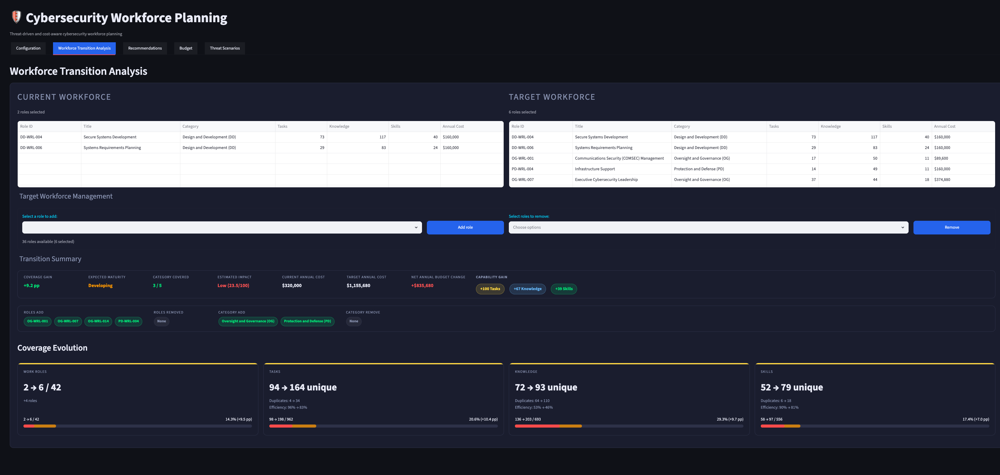
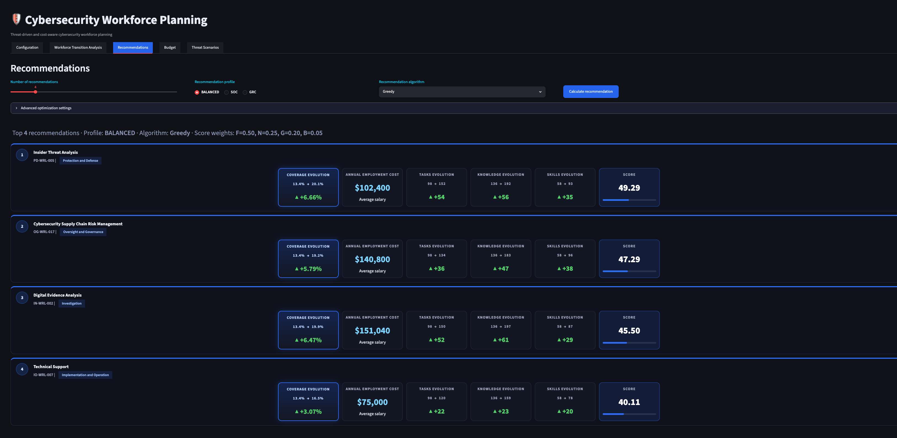
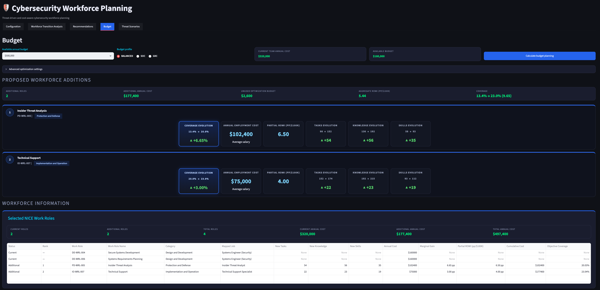
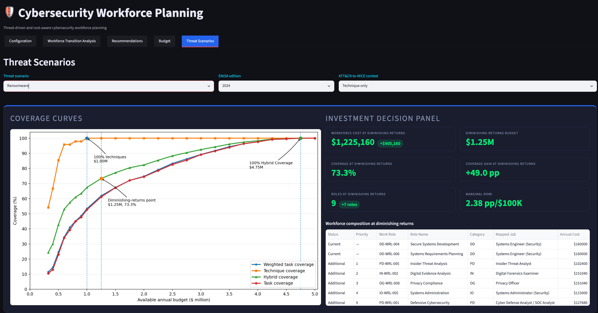

# Cost-Aware Cybersecurity Workforce Planning

A Streamlit decision-support application accompanying **Cost-Aware Cybersecurity Workforce Planning Using the NICE Workforce Framework**, by José A. Montenegro and Ruben Rios.

The application connects NICE Work Roles, Tasks, Knowledge, and Skills with workforce costs and budget constraints. The threat-planning pipeline maps ENISA threat scenarios to MITRE ATT&CK techniques, retrieves related NICE Tasks using sentence embeddings, and projects those Tasks onto Work Roles.

The ransomware case study uses the 2024 and 2025 ENISA Threat Landscape editions, ATTACK-BERT and MiniLM, and three semantic-context variants. Greedy and mixed-integer linear programming (MILP) methods support comparisons of workforce cost and capability coverage.

## Online application

Access the deployed [Workforce application on Streamlit Community Cloud](https://niceworkforceplaning-mzrw9uc9fz2tgsrbrvxj5w.streamlit.app/). No local installation is required.

## Run the Workforce application

Use **Python 3.12**. From the repository root:

```bash
python3.12 -m venv web-force/.venv
web-force/.venv/bin/python -m pip install -r web-force/requirements.txt
./web-force/run.sh
```

Open **http://127.0.0.1:8503**. Stop the server with **Ctrl+C**.

The launcher uses Workforce's own environment and resolves its working directory. Once installed, it can also be started from `web-force/` with `./run.sh`.

The application expects these local inputs:

```text
data/
├── v2-2-0_nf_components.json
├── role_costs.csv
└── all_models/
    ├── 2024/
    │   ├── tasks/
    │   └── roles/
    └── 2025/
        ├── tasks/
        └── roles/
```

Paths are resolved relative to the repository by [configuration.py](web-force/configuration.py). Keep the data directories when copying or packaging the application. Threat Scenarios uses the stored mappings; it does not need to recompute embeddings to display the analyses.

`data/company_state.json` is optional saved application state. It is created when a user saves their organization profile and workforce, and is not required for the initial launch.

## Application views

The interface provides organization configuration, workforce transition analysis, Work Role recommendations, budget planning, and threat scenarios. The screenshots below are original figures from the paper; their values illustrate the configurations shown.

### Workforce transition analysis

Compare current and target Work Roles, annual employment costs, and changes in Task, Knowledge, and Skill coverage.



*Manual workforce transition analysis example.*

### Work Role recommendations

Rank candidate additions using configurable profiles and inspect their expected capability gains and costs. In the paper's general recommendation experiment, each candidate is assessed independently against the initial workforce; gains are not cumulative.



*Prioritized Work Role recommendations under the Balanced profile and average-cost scenario.*

### Budget-constrained planning

Select additions within a total annual budget, accounting for the cost of the current team and overlapping capabilities among Work Roles.



*Budget-constrained workforce planning under a total annual budget of $500,000.*

### Threat Scenarios: ransomware in 2024

The paper's threat-planning example uses **Ransomware**, the **2024 ENISA Threat Landscape**, and **Variant A (technique-only context)**. ATTACK-BERT associates the scenario's ATT&CK techniques with NICE Tasks, which are then linked to Work Roles for budget-constrained planning.

The view compares Task Coverage, Weighted Task Coverage, Technique Coverage, and Hybrid Coverage as the annual budget increases. Its investment panel identifies the diminishing-returns point and the workforce composition at that point.



*Budget–coverage evolution and workforce planning for the 2024 ransomware scenario under Variant A.*

In the illustrated configuration, the diminishing-returns budget is **$1.25 million**, with **73.3% Hybrid Coverage**. The selected workforce costs **$1,225,160 annually** and contains **nine Work Roles**, including seven additions to the initial team. These values describe the paper example shown in the figure.

## Repository layout

| Path | Purpose |
| --- | --- |
| [web-force/](web-force/) | Workforce application, configuration, requirements, launcher, and scoring tests |
| [data/](data/) | NICE Framework snapshot, role costs, and stored ATT&CK–NICE mappings |
| [data/all_models/](data/all_models/) | 2024 and 2025 mappings for ATTACK-BERT and MiniLM, variants A, B, and C |
| [docs/figures/](docs/figures/) | Original paper figures displayed in this README |

This repository packages the Workforce application and its runtime inputs. It does not include the scenario-generation pipeline, research experiment outputs, or the separate annotation application. The Threat Scenarios view runs on the precomputed mappings supplied in `data/all_models/`.

## Data and reproducibility

The stored mappings use these semantic-context variants:

| Variant | Technique weight | Tactic weight | Mitigation weight |
| --- | ---: | ---: | ---: |
| A | 1.00 | 0.00 | 0.00 |
| B | 0.90 | 0.10 | 0.00 |
| C | 0.85 | 0.05 | 0.10 |

The baseline retains up to **10 Tasks per technique** with a minimum similarity of **0.25**. The application reads the supplied mappings without downloading embedding models.

- Keep the supplied NICE snapshot, costs, and stored rankings when reproducing application analyses. Original embedding model revisions and the full generation environment are not pinned by this application package.
- Coverage quantifies the modeled NICE capabilities and retained ATT&CK–NICE associations; it does not measure real-world incident prevention.
- The paper's semantic relevance audit uses model-assisted labels, not human-expert ground truth.
- The README figures are unchanged copies of the PNGs referenced by the paper manuscript. The LaTeX drafts are not required to display them.
- Saved organization state, local databases, credentials, and virtual environments are excluded from this repository.

## Tests

Run the Workforce scoring checks from the repository root:

```bash
web-force/.venv/bin/python -m unittest discover -s web-force -p 'test_scoring_consistency.py'
```

